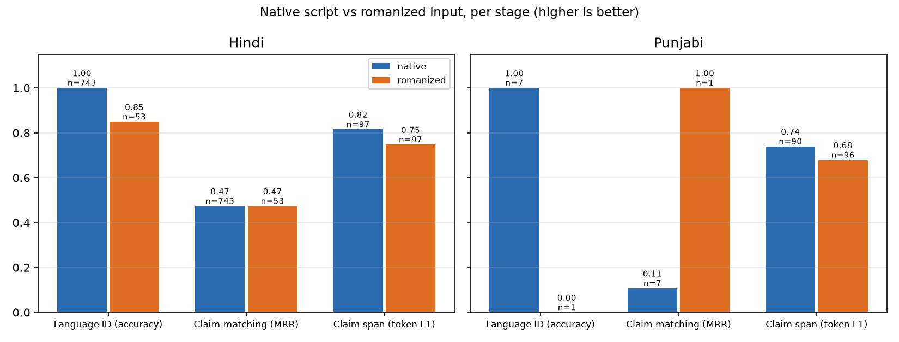

# TruthLens: multilingual claim verification for WhatsApp forwards in English, Hindi and Punjabi

CSE472 project report · Soumirya Sarangi · final draft of 2026-10-05

> **How to read the numbers.** Every number carries the results file it came
> from: `(run <hash>)` refers to `results/<hash>.json`, and
> `scripts/check_report_numbers.py` verifies each one against that file.
> - **Development (dev) numbers** chose every model and threshold.
> - **Test numbers** come from one pre-registered run on frozen code
>   (`docs/test-protocol.md`; §8). Where the two disagree, the test number is
>   the finding.

## 1. Summary

TruthLens takes a forwarded WhatsApp message in English, Hindi or Punjabi —
in native script or typed in Latin letters — and answers with a verdict, the
sources behind it, a calibrated confidence, an explanation, and, when it is not
confident, an explicit refusal to judge. It mirrors how fact-checkers work:
first look for a published fact-check of the same claim (the *fast path*), and
only then retrieve evidence and reason over it (the *evidence path*).

**Read the verdict numbers against the right yardstick.** Published systems on
AVeriTeC report roughly 47–50% accuracy. On this data the majority class
(Refuted) is 61% of dev, so always answering "Refuted" scores accuracy 0.61 and
macro-F1 0.1516 (run 8350085fbc7f): accuracy alone would rank a constant above
every model. This report therefore leads with macro-F1 over five classes, always
beside the majority baseline. Because no AVeriTeC claim is `NotAClaim`, macro-F1
on AVeriTeC is capped at 0.80 by construction.

Headline findings, on the locked test split unless marked:

1. **Reading the evidence did not help the verdict.**
   - **On test:** the served pipeline scores macro-F1 0.2622 (run 0c41481ee90d),
     against 0.1447 for always-Refuted. A control that never sees the evidence,
     only the claim, scores 0.3085 (run 36e3f8e6094c). The served pipeline is
     lower by 0.0463, with a 95% interval of [−0.094, +0.001], just short of
     significance.
   - **On dev the two tied**, and that is why the evidence-reading arm was
     served at all.
   - **The cause** is retrieval: only 15.3% of test claims get any gold document
     into the top 10 (Success@10 0.1531, run 3cd7a0719b5b). The system mostly
     reasons over evidence that does not contain the answer, so the claim's
     wording carries the verdict.
2. **Abstention ranks claims correctly, but the threshold was set too
   generously.**
   - Answering only its most confident claims raises test accuracy from 0.4625
     to 0.80 at the top 5%.
   - At the threshold chosen on dev, accuracy reaches 0.500 (run 0c41481ee90d)
     at 63% coverage. That is still below always-Refuted, whose accuracy is
     0.57.
   - **Calibration held up out of sample:** test ECE is 0.039 after temperature
     scaling, against 0.0661 before (run c3128d753fc7).
3. **The romanization penalty is real for claim spans; the matching penalty
   was a measurement artefact.**
   - **Claim spans, on identical posts:** romanizing costs Hindi 0.068 token F1
     and Punjabi 0.061 on test (§7). On dev the costs were 0.034 and nothing.
     This is a lower bound: synthetic romanization is cleaner than real typing.
   - **Claim matching:** the dev "romanization penalty" did not replicate on
     test. The data says why: two-thirds of MultiClaim's "romanized Hindi" posts
     are Devanagari posts with Latin hashtags, or English.
4. **The fast path is precise only where it barely fires.** At the served
   τ_match 0.90 it answers 1.7% of posts at 81% precision (run 891eecc6a90e).
   Wherever it fires more often, it is wrong more often.
5. **The confident mistakes are the claim prior's.** On real forwards, the
   system refuted three true claims. The claim-only control refutes them too
   (§9).
6. **After the test run (none of it touches a number above).** Two things were
   added, both opt-in and absent from every evaluation. A lexicon-first
   transliteration and a native-script query improved romanized free text (§8a).
   A per-claim "search online" button queries Wikipedia and Google Fact Check
   and, under a rule that was pre-registered and then passed on 350 fresh
   claims, gives a verdict when two NLI models agree: right on 100 of 106
   answers, 3 false "Supported" among 225 false or unverifiable claims, and an
   answer for only about 3 claims in 10. An earlier pre-registered attempt
   missed its accuracy bar by two claims, and both results are reported (§8b).

## 2. Problem and users

Forwarded messages are the dominant channel for misinformation in India, and
they arrive in Hindi and Punjabi typed in whatever script the sender's keyboard
gives them, often Latin letters. The primary user is a person who has received
a forward and wants to know whether to believe it before passing it on. The
system's principles, in order of precedence (PRD §4):

- no verdict without evidence;
- abstaining is a feature, visibly different from "not enough evidence";
- every verdict shows its sources;
- romanized input is the primary case;
- honest numbers over good-looking ones.

**Non-goals, stated as decisions:** images, video and links; adjudicating
opinions, predictions or political values (these route to `NotAClaim`); a real
WhatsApp bot; redistributing any licensed dataset.

## 3. Data

| Use | Dataset | Splits (train / dev / test) | Notes |
| --- | --- | --- | --- |
| Verdict, evidence | AVeriTeC | 2,666 / 500 / 307 | Official test labels are withheld, so the local test split is 307 claims held out of the public train file, stratified by label (seed 42) |
| Claim spans | X-CLAIM (en/hi/pa) | 4,472 / 600 / 571 | Per-row script detection: Punjabi files hold Gurmukhi, Devanagari and Latin rows |
| Romanized spans | `x_claim_romanized` (built here) | — / 183 / 193 | X-CLAIM's native hi/pa eval posts, romanized (§7) |
| Claim matching | MultiClaim (en/hi/pa) | 25,137 / 3,153 / 3,156 | 78,077 fact-checks in the pool; naturally romanized Hindi posts; Punjabi has only 7 dev and 7 test posts |
| Normalization | CheckThat! 2025 Task 2 | — / dev / 1,485 test | Cross-dataset overlap with X-CLAIM resolved by removing train rows |
| Stance (derived) | AVeriTeC QA answers | 6,616 / 1,260 / 789 | Labels inherited from the claim's verdict, so noisy by construction |
| Real forwards | Hand-typed (collected) | — / 100 / — | 64 hi / 36 pa, all Latin script; 15 deliberate non-claims; 33 with a Gurmukhi rewrite |

**Integrity guarantees** were built before any model:
- splits are frozen under `SPLITS.lock` and rebuild byte for byte from the raw downloads in CI;
- four leakage checks (exact, near-duplicate, cross-dataset, semantic) run on every data change;
- the train split always yields to eval: overlapping train rows are dropped and eval rows never are;
- the test split is locked at every entry point that could look at it (§8).

## 4. System

```
forward ─► language layer ─► check-worthiness ─► claim extraction ─► (≤3 claims)
           LID, script,       heuristic gate      span model picks
           transliteration    (→ NotAClaim)       claim sentences
                                                        │
              ┌──────────── fast path: BGE-M3 over 78k fact-checks, cosine ≥ τ_match ──► verdict of the fact-check
              │
              └──────────── evidence path: BM25 top-200 → BGE-M3 passage rerank (RRF)
                            → stance per passage (NLI labels shown; XLM-R distribution
                            read by the verdict) → learned aggregator (LR, temperature)
                            → τ_abstain → IndicBART explanation behind an NLI gate,
                            template fallback; manipulation flags (never change the verdict)
```

Every stage has at least two registered implementations, including a dumb
baseline, and is chosen by configuration. The served API and the evaluation
batch runner call the same orchestrator. The served pipeline runs in 4.60 GiB
of a 6 GB laptop GPU, answers in 2.51 s at the 95th percentile, and starts in
61 s (`docs/environment.md`).

**The optional live step (post-test, §8b).** When the user presses the
per-claim button, the claim is also sent to Wikipedia and Google Fact Check. It
is translated to English, a page is judged only if it is about the claim's
subject, and two NLI models (DeBERTa-v3-large, BART-large-MNLI) must give the
same Supported or Refuted verdict, otherwise there is no verdict. The three live
models wait in CPU RAM and visit the GPU one at a time, so the peak stays at
3.81 GiB (6.20 GiB when resident), and a live click takes a median of 2.2 s once
its sources are cached. It never runs in an evaluation.

## 5. Experiments, by syllabus unit

Every number is from AVeriTeC, X-CLAIM, MultiClaim or CheckThat! dev, beside
the baseline it had to beat.

### 5.1 Units I–II: representations, and the language layer

**Embedding ladder, scored as retrieval** (MultiClaim dev, 3,153 posts against
78,077 fact-checks, MRR; random baseline 0.0002):

| Encoder | MRR | Run |
| --- | --- | --- |
| Word2Vec (trained in-domain) | 0.0915 | 7a5b458b7ed0 |
| MuRIL | 0.1127 | 1cf1125ab395 |
| TF-IDF | 0.2311 | 04472bc51f18 |
| LaBSE | 0.3216 | 527489a99261 |
| **BGE-M3** | **0.5244** | 3bebeaff50b0 |

TF-IDF beats Word2Vec and MuRIL. Without a lexical rung in the table, MuRIL's
number would have read as a result instead of a warning. LaBSE, a translation
model, is used only for the cross-lingual t-SNE figure
(`docs/figures/tsne_parallel_claims.png`). That figure shows **romanization
forming a cluster of its own**: two unrelated sentences, one romanized Hindi and
one romanized Punjabi, are closer to each other than one sentence is to itself
across scripts.

**Language ID and transliteration on the 100 hand-typed forwards:**
- **Language ID.** A script rule cannot tell romanized Hindi from English, and
  neither can fastText. The hybrid (script, then a romanized-text classifier)
  reaches 0.85 accuracy (run 5dcb60467eca), where both alternatives score 0.
- **Transliteration back to Gurmukhi.** Rule-based CER is 0.4281
  (run f141a4d92b33) against 0.8518 for leaving the text alone; 0.3810 with
  the language given (run 331c34fb9bdd). An accurate transliterator would help
  most, but IndicXlit could not be installed without replacing the CUDA build of
  PyTorch.

### 5.2 Unit V: the front of the pipeline

**Claim spans (X-CLAIM dev, token F1 over claim tokens):**

| Arm | Token F1 | Run |
| --- | --- | --- |
| Whole post is the claim (baseline) | 0.6851 | c108ee694a53 |
| Monolingual, en / hi / pa | 0.7106 / 0.7053 / 0.7175 | (three runs, project log) |
| Zero-shot (trained on English only) | 0.7370 | f6cfdfc688fe |
| **Joint multilingual** | **0.7463** | f599f727f473 |

Joint training beats every monolingual arm, replicating X-CLAIM's own finding,
and zero-shot ties joint on Punjabi, so Punjabi span-finding is almost entirely
cross-lingual transfer.

The served extractor was, until Phase 7, a sentence rule. It had never been
scored on this task: 0.7095 (run 6debf902eac4), barely above the whole-post
baseline. On a real forward it checked "Dosto dhyan se padho!!" ("friends,
read carefully") and refuted it at 0.83. The served stage now lets the rule
decide *whether* there is a claim and the joint span model decide *which*
sentences: 0.7374 (run e1b2227b28d9), with the AVeriTeC verdict unchanged
within its confidence interval.

**Check-worthiness (FR-6).** On a check-worthiness set derived from X-CLAIM, a
trained classifier scores 0.7222 (run 9007de0fde93). On the 100 real forwards it
scores 0.4536 (run 702ab276ae11), below the majority baseline. Zero-shot NLI is
the only arm above the baseline there, at 0.5938 (run 34bd7770cb7f), but it
rejects about one real claim in five. The two sets rank the arms in opposite
orders, so the derived set cannot choose an operating point. The served gate
is the rule: a false "nothing to check" fails the user completely, while a false
"check-worthy" costs a harmless NEI.

**Normalization.** Extractive normalization scores chrF 0.2835
(run c080a5079e93), at the longest-sentence baseline. Only about 4% of
reference normalizations appear verbatim in their post, so the task needs an
abstractive model (cut, §11).

### 5.3 Claim matching and the fast path

BGE-M3 reaches MRR 0.5244 (run 3bebeaff50b0) against BM25's 0.3826
(run de7ef9c9bba3). Ranking well is not the same as *scoring* well. The fast
path needs the score to say when a match can be trusted, and correct and wrong
top-1 matches overlap heavily in cosine. The τ table (run da5132cee8a0) is the
result:
- at τ 0.70 the gate answers 40% of posts at 62.7% precision;
- at the served τ 0.90 it fires on about 2% and is still wrong about one time
  in five.

Both trained rerankers lost to the raw cosine. The cross-encoder learned to
score fact-checks rather than pairs, a construction bug in its training data
that is diagnosed in the project log.

### 5.4 Unit III: evidence retrieval and stance

**Retrieval (AVeriTeC dev).** Hybrid retrieval (BM25 top-200, BGE-M3 passage
rerank, reciprocal rank fusion) lifts Success@10 to 0.214 (run d153f28ff603)
from BM25's 0.158 (run cb8f6f0f3b5c). Read it against two ceilings:
- BM25 finds only 58% of gold documents within its top 200;
- 22.8% of dev claims have no gold document with any text at all.

**Stance: every trained model has a claim-only twin.** The derived stance
labels copy the claim's verdict onto every evidence answer, so the claim alone
predicts them. XLM-R + LoRA beats its claim-only twin, 0.4582
(run 19f53468cdc2) against 0.4098 (run 1e77b96812d3), on answered pairs. The
BiLSTM is the Unit III baseline.

### 5.5 Units IV and VI: verdict, calibration, abstention, explanation

**The rule aggregator rewarded ignoring the evidence.** Its Conflicting rule
fires whenever support and refutation co-occur. That can never happen to a
model that gives every passage the same distribution, so the claim-only control
won under the rule: 0.2514 (run 8350085fbc7f).

**The learned aggregator** (multinomial logistic regression over the whole
top-10 stance distribution, trained on cross-fitted stance outputs,
temperature-scaled on dev) beats the rule on the control by
0.0435 (run ab1cc94cd247), 95% interval [+0.0073, +0.0779]. Against it:

| Stance arm | Verdict macro-F1 | Run |
| --- | --- | --- |
| claim-only control | 0.2949 | ab1cc94cd247 |
| XLM-R (reads evidence) | 0.2802 | 7750edef4c7a |
| BiLSTM | 0.2340 | 2089ec927435 |
| NLI, zero-shot | 0.2135 | c2ffd949681b |

XLM-R ties the control on a paired bootstrap, and the BiLSTM and NLI arms are
significantly worse. **The served stance does two jobs with two models.** XLM-R
decides the verdict: +0.0667 macro-F1 over NLI (run 24d42acb4fea), with a 95%
interval of [+0.022, +0.112]. NLI labels the passages the user sees, because XLM-R labels
nearly every passage "Refutes" whatever it says.

**Calibration and abstention.**
- Temperature scaling, fitted on dev, takes ECE from 0.0988
  (run 204b09b37d27) to 0.0690 (run 164d2289c90b).
- τ_abstain was fixed before measuring, by a rule written in advance: the lowest
  threshold leaving at most 60% of claims answered. That gives τ 0.3835 and
  accuracy 0.5867 on the answered 60% (run 164d2289c90b).
- The full coverage curve is `docs/figures/abstention_curve.png`, with the
  majority line drawn on it. The reliability diagram is `docs/figures/reliability.png`.

**Explanations.** IndicBART + LoRA writes an English explanation from the
retrieved passages. An NLI gate serves it only if every sentence is entailed by
a shown passage, and none restates the claim under a verdict other than
Supported; otherwise the template is served.
- **Faithfulness, by decoding.** Before the gate, beam search is faithful 0.524
  of the time (run 1db244b950ad). Greedy is 0.500 (run 9d827bf6c5ab) and
  nucleus sampling 0.408 (run 49db61975b8d).
- **Against the baseline.** Copying the top passage's first sentence scores
  0.628. It is faithful by construction, which is why chrF against reference
  justifications is reported beside it.
- **Gold evidence is worse here, for a measured reason.** On gold QA evidence
  faithfulness falls to 0.272 (run d0b2219a6411), because the model paraphrases
  shorter evidence into contradictions.
- **The attention figure** (`docs/figures/explainer_attention.png`) shows the
  decoder's cross-attention over the evidence passages.

## 6. Demo

**For ordinary readers first.** TruthLens is for people who receive forwards, not for engineers, so
the first thing on every answer is a plain card in the reader's own language: one large verdict word
("Probably FALSE", "Hard to say"), one sentence of why, what to do ("Please don't forward it"), the
closest sources, a warning in words when the message tries to scare or rush the reader, and two
buttons: **Listen** (the browser's own speech) and **Copy a reply** (a ready message for the family
group). The technical card the project measured (verdict class, confidence band, explanation,
evidence trail) sits in a closed "Details" fold, so nothing was removed. The wording says "probably"
and "the sources I found": it reports what sources say, never the truth.

**The evidence-path guess is not shown as an answer.** (It is shown as "Be careful with this one: I couldn't find a source
that checks this exact claim; most messages like this turn out to be false", which is the only thing the guess ever knew.) The owner's own questions ("Has NEET paper ever been
leaked?", "Methyl Phenidate is good medicine for ADHD", and a trivially true "Paris is the capital of France")
were all answered "Refuted" with unrelated or off-claim sources. That is the section 1 finding seen from the
user's side: on free text the offline verdict mostly reflects "forwarded claims are usually false" (in the
pre-registered test of section 8b it said Refuted for 122 of the 125 true claims and never Supported). So the card
says "Hard to say: I couldn't find a source that checks this exact claim" and offers the online look-up; the
system's own lean stays in Details, marked unreliable. A verdict is shown only where one was earned: a matched
published fact-check, or the live check that passed its pre-registered test. A message the claim gate refuses
can be sent anyway with "Check it anyway". A published fact-check that scored below the fast-path bar but above a
second, lower threshold is offered as "a fact-checker looked at something similar ... this may not be the same
message", with the publisher's own rating; that threshold was chosen on dev by a rule fixed beforehand
(`docs/similar-factcheck-protocol.md`) and sits at 0.86, so the card is rare (about 5% of real posts, dev precision
0.742); lowering it trades how often it appears against how often it points at the wrong fact-check. A usability test with
relatives, with questions and pass bars fixed beforehand, is specified in `docs/usability-test.md`;
its results are in `docs/usability-results.md` once run. The rest of this section describes the page.

The page (`app/`) is styled after the chat app the forward came from. It has a
verdict card with an icon and a word (never colour alone), a confidence band
rather than a percentage, an abstained card that shows the would-be verdict
greyed as "Leaning: …", and an evidence trail with stance tags and highlighted
spans; each `[n]` in the explanation jumps to its source. Six sample chips cover
the six paths of UI_UX §11. `scripts/demo_check.py` fails if any chip stops
showing its path. The Roman-Hindi chip was chosen by a rule written before
running 14 candidates, and only one qualified, which says how rarely romanized
free text finds apt evidence offline. A "search Wikipedia & fact-checkers"
button on a card sends only that claim and shows the live card (§8b): a verdict
only when two models agree, the test numbers in plain words, and a note that its
confidence is uncalibrated. Contrast meets WCAG AA in light and dark mode
(`tests/test_ui_static.py`).

## 7. The research contribution: the romanization penalty



Native script against romanized input, per stage. Each row is one split, and
the n beside each cell is the number of posts.

| Stage, split | Hindi: native → romanized | Punjabi: native → romanized | Run |
| --- | --- | --- | --- |
| Language ID (accuracy), test | 1.0000 → 0.8491 (n = 743 / 53) | 1.0000 → 0.0000 (n = 7 / 1) | df0c94346f9e |
| Language ID (accuracy), dev | 1.0000 → 0.7368 (n = 737 / 57) | 1.0000 → 0.0000 (n = 7 / 2) | 7f4d2e1ee058 |
| Claim matching (MRR), test | 0.4731 → 0.4736 | 0.1071 → 1.0000 (n = 7 / 1) | c6ba8b41e869 |
| Claim matching (MRR), dev | 0.4981 → 0.3585 | 0.4333 → 0.5000 (n = 7 / 2) | 3bebeaff50b0 |
| Claim span, native side, test (same posts) | 0.8151 (n = 97) | 0.7394 (n = 90) | 418bf3876e80 |
| Claim span, romanized side, test (same posts) | 0.7473 (n = 97) | 0.6789 (n = 96) | 67e8435985a6 |
| Claim span, native side, dev | 0.7805 (n = 96) | 0.8382 (n = 76) | 02c59ee296a0 |
| Claim span, romanized side, dev | 0.7468 (n = 96) | 0.8453 (n = 87) | f05dd5f44b16 |

**What holds, and what did not:**

- **Claim spans pay a real penalty, in both languages, on test.**
  - Measured on the same posts once as written and once romanized: Hindi
    0.8151 → 0.7473, Punjabi 0.7394 → 0.6789.
  - The Punjabi native cell counts only Gurmukhi posts; the six Devanagari
    Punjabi posts are a separate cell too small to report.
  - Dev showed half the Hindi penalty and none for Punjabi. Dev and test are
    each about a hundred posts per language, so the test value is the one to
    quote.
  - It is a **lower bound**. The romanizer (Dakshina's lexicon, plus rules for
    words it lacks) is CER 0.2141 (run 3f33f4e33934) away from how people
    actually typed the same Punjabi messages, against 0.8046 for doing nothing.
    Real typing is messier.
- **Language ID pays it on real typing.**
  - Romanized Hindi is identified correctly 85% of the time on test and 74% on
    dev, against 100% for Devanagari.
  - On the hand-typed forwards, every failure was code-mixing (§9).
- **The claim-matching penalty seen on dev did not replicate, and it was never
  a clean measurement.** MultiClaim's "romanized Hindi" cell is defined by
  majority script, and on inspection most of it isn't romanized Hindi:

  | | dev | test |
  | --- | --- | --- |
  | Posts in the cell | 57 | 53 |
  | Devanagari posts that are Latin-majority only through hashtags and URLs | 23 | 23 |
  | Mostly English | 14 | 13 |
  | Hindi typed in Latin letters | 20 | 17 |

  (Profiled by script and by Hindi function words; `docs/project-log.md`.) A
  0.14 MRR gap on such a mixture is not evidence either way. A proper test
  needs a set of real romanized posts, which this project could not collect at
  matching scale.
- **Punjabi matching cells are single digits** and support no conclusion.

**The contribution, stated precisely.** Romanization's measured cost lands on
the stages that read *characters*: language ID, and a claim-span tagger. There
it costs 6–7 points of span F1 even with clean synthetic romanization. Measuring
it in retrieval needs a cleaner romanized set than any public dataset provides.
The cheapest fix the measurements point to is the language layer: an accurate
transliterator before the span tagger, which IndicXlit would have been, had it
been installable (§11).

## 8. Test results

These come from the one pre-registered run. Every test command was first
proven on dev, reproducing its dev twin's predictions byte for byte. The run used
frozen code: nothing under `src/` or `app/` changed after the `code-freeze` tag.
Each config was scored once.

| # | Component | Test result | Same-table baseline | Run |
| --- | --- | --- | --- | --- |
| 2-3 | Verdict, served (AVeriTeC, 307) | macro-F1 0.2622, accuracy 0.4625 | always-Refuted: macro-F1 0.1447, accuracy 0.5668 | 26e4cf2fa3d8 |
| 1 | Verdict, claim-only control | macro-F1 0.3085, accuracy 0.4853 | always-Refuted: macro-F1 0.1447 | 36e3f8e6094c |
| 2 | Served vs control, paired bootstrap | served 0.2622 vs control 0.3085: −0.0463, 95% interval [−0.0944, +0.0008] | — | 0c41481ee90d |
| 4 | Abstention at the dev τ 0.3835 | coverage 0.6319; accuracy 0.5000, macro-F1 0.2627 | answering everything: accuracy 0.4625, macro-F1 0.2622 | 0c41481ee90d |
| 5 | Calibration | ECE 0.0390 after temperature scaling | before temperature scaling: 0.0661 | c3128d753fc7 |
| 6 | Evidence retrieval, hybrid | Success@10 0.1531, MRR 0.0679 | BM25: 0.1107, 0.0497 | 3cd7a0719b5b |
| 6 | Evidence retrieval, BM25 | Success@10 0.1107 | random: 0.0228 | f98e27174df6 |
| 7 | Explanations, beam, retrieved passages | faithful 0.4723, chrF 0.2370 | extractive: 0.6059, 0.1920 | 08ae7470902c |
| 8 | Claim span, joint model (571) | token F1 0.7254 | whole post: 0.6267 | fa5bda794fa2 |
| 9 | Claim span, served extractor | token F1 0.7220, exact match 0.3608 | whole post: 0.6267, 0.2294 | 22fe569d3904 |
| 10 | Claim span, romanized (193) | token F1 0.7126 | whole post: 0.6933 | 67e8435985a6 |
| 11 | Claim span, native, same 193 posts | token F1 0.7759 | whole post: 0.6933 | 418bf3876e80 |
| 12 | Claim matching, BGE-M3 (3,156) | MRR 0.5355, Success@10 0.6987 | random: 0.0000 | c6ba8b41e869 |
| 12 | Claim matching, BM25 | MRR 0.3928, Success@10 0.4940 | random: 0.0000 | c437b80668d7 |
| 13 | Fast path, τ 0.90 | coverage 0.0168, precision 0.8113; AUCC 0.6176 | gate removed: AUCC 0.4605 | 891eecc6a90e |
| 14 | Normalization (1,485) | chrF 0.2666 | longest sentence: 0.2786 | c8f12f399fc7 |
| 15 | Language ID (3,156) | accuracy 0.9924 | majority: 0.7449 | df0c94346f9e |

**The same components on dev, for comparison:**

| Component | Dev result | Run |
| --- | --- | --- |
| Verdict, served | macro-F1 0.2802 | 164d2289c90b |
| Verdict, claim-only control | macro-F1 0.2949 | ab1cc94cd247 |
| Calibration | ECE 0.0690 | 164d2289c90b |
| Retrieval, hybrid | Success@10 0.2140 | d153f28ff603 |
| Explanations | faithful 0.5240 | 1db244b950ad |
| Claim span, joint / served | 0.7463 | f599f727f473 |
| Claim span, served extractor | 0.7374 | e1b2227b28d9 |
| Claim matching, BGE-M3 | MRR 0.5244 | 3bebeaff50b0 |
| Fast path | AUCC 0.5842 | da5132cee8a0 |
| Normalization | chrF 0.2835 | c080a5079e93 |
| Language ID | accuracy 0.9892 | 7f4d2e1ee058 |

**Reading the test table:**

- **Most components transfer.** Matching, the fast path, language ID, spans and
  calibration score at or near their dev values; calibration is even better out
  of sample. Normalization stays at its baseline, as on dev.
- **The verdict does not, and that is the main finding.** The evidence-reading
  pipeline falls below the claim-only control (−0.046, interval just touching
  0). The gap to the majority baseline stays wide: macro-F1 0.2622 against
  0.1447.
- **Retrieval explains most of it.** Hybrid retrieval drops from Success@10
  0.214 on dev to 0.153 on test. When the evidence contains the answer for only
  one claim in six, a verdict model can do little better than read the claim,
  and the control reads the claim without the noise.
- **Abstention ranks correctly but under-delivers at the chosen threshold.**
  Accuracy rises with confidence all the way to 0.80 at 5% coverage
  (`docs/figures/abstention_curve.png`). But the dev-chosen τ answers 63% of
  test claims at accuracy 0.500, below always-Refuted's 0.567. A product
  setting τ for "beat the constant" would choose about 25% coverage, chosen on
  dev, as this one was.

**Why the AVeriTeC verdict excludes the fast path.** AVeriTeC claims are taken
from fact-check articles, and the matcher's pool contains fact-checks. With the
matcher on, the fast path answered dev claims by finding the claim's *own*
source article, which AVeriTeC's rules exclude as evidence. It moved macro-F1
only slightly, to 0.2819 (run 5d4fd8d511e6), but that is a lookup, not
verification. Every AVeriTeC verdict number, dev and test, is the evidence
path; the fast path is measured on MultiClaim.

## 8a. After the test run: one fix for romanized input

The test numbers above describe the frozen system and stay as they are. After
the run, one demo failure was traced to its cause and partly fixed. The fix is
measured on dev and on the demo forwards only.

**The failure.** "Taj Mahal Shah Jahan ne banwaya tha" (the Taj Mahal was built
by Shah Jahan; true) was refuted at 0.72, in the High band. Three things went
wrong in a row:
1. **The transliterator garbled the names:** तज महल शह जहन instead of ताज महल
   शाह जहाँ. Rules cannot recover a long vowel in the middle of a word.
2. **The claim was searched in Latin letters anyway.** Nothing downstream read
   the transliteration, so the Hindi corpus was never searched in its own script.
3. **With no passage saying who built it, the claim prior decided.** The
   claim-only control refutes it too (§9).

**What changed** (both apply to free text only; AVeriTeC and MultiClaim
numbers cannot move):
- **The transliterator now looks words up first.** It reads Dakshina's training
  lexicon backwards, mapping a typed word to its most-attested native spelling,
  and uses the rules only for words the lexicon lacks.
  - Rule fixed before measuring: adopt it only if it beats the rules on the
    hand-typed Punjabi pairs.
  - It did: character error rate 0.3359 (run 832a76d75780) against 0.4281
    for the rules. That also beats the rules given the true language (0.3810).
- **Romanized Hindi and Punjabi free text is now searched with the claim's
  native-script form as well.**

**Tried and rejected: abstaining when the evidence doesn't mention the claim.**
The rule: if no passage contains half of the claim's content words, abstain.
The threshold was fixed before it was run.
- On the demo forwards it stopped one wrong refutation.
- But it abstained on a well-supported one. The lemon-water claim's best
  evidence is a Spanish fact-check and a Hindi page with an inflected verb, and
  word overlap scores them 0.00 and 0.40.
- A word-overlap check cannot judge the cross-lingual evidence this corpus is
  made of. It is kept in the code, switched off.

**Result on the regression forwards:**

| Forward (truth) | Before | After |
| --- | --- | --- |
| Narendra Modi Gujarat ke mukhyamantri rahe hain (true) | Refuted 0.67 | abstained, leaning NEI |
| Taj Mahal Shah Jahan ne banwaya tha (true) | Refuted 0.72, High | Refuted 0.57, Medium |
| The other six forwards and all six demo chips | — | unchanged |

**What this does not fix.** The Taj Mahal is still wrong:
- The search now finds Hindi pages about Shah Jahan's buildings, including the
  legend of a *black* Taj Mahal.
- It still misses the Taj Mahal article itself, whose title is one word
  (ताजमहल), not two.
- With no passage stating the fact, the claim prior still decides, though no
  longer confidently.

Removing that prior means retraining the verdict model with a correction for
the claim-only signal. That needs a new dev selection, and the test split is
spent, so it is future work.

## 8b. After the test run: live search, and a verdict that was earned in the end

Live search was cut-list item 2 (a static corpus, with the recency limitation
reported). After the demo showed true claims such as "Modi was Gujarat's chief
minister" left undecided, it was built, opt-in per claim, from Wikipedia and the
Google Fact Check Tools API. It cannot affect any reported number: it is off in
every evaluation, never applies to AVeriTeC, and the AVeriTeC dev run reproduces
the served predictions byte for byte with it in place.

### Four hand-written probe sets: closer each time, never adopted

Each set was scored under a rule fixed in advance: adopt a live *verdict* only if no
answer that was correct turns wrong, at least one true claim becomes correct, and no
unverifiable claim is decided. The sets are small demo sets, reported claim by claim
(`docs/live-search-probe.md`).

| Set | claims | what changed before it | live: correct / wrong | rule |
| --- | --- | --- | --- | --- |
| 1 | 40 | the first verdict path | 24 / 3 | fails: 2 correct became wrong |
| 2 | 35 | ratings as stances, NLI on focused sentences | 15 / 5 | fails: 3 correct became wrong |
| 3 | 39 | claim translated to English, English NLI (DeBERTa-v3-large) | 28 / 2 | fails: 1 unverifiable decided |
| 4 | 38 | an entity-grounding gate (the judged page must be about the claim's subject) | 18 / 1 | fails: 1 correct became wrong |

The live-wrong count fell 5, 5, 2, 1 while the correct count rose, but a set of about
38 claims cannot measure a rate, and one miss rejected the path with no interval either
way. The one remaining error was "Kalpana Chawla was the first Indian to travel to
space" called Supported, from a page that says she was the first Indian-born woman in
space: a qualifier the NLI cannot separate.

### Two pre-registered measurements on FEVER

So the question was moved to a benchmark large enough to put an interval on the error
that matters, a false claim called Supported. Protocols and decision rules were written
and committed before any claim was run (`docs/live-fever-protocol.md`,
`docs/live-fever-protocol-2.md`); the claims are from FEVER dev (CC BY-SA), and the
system run is exactly what the UI button runs.

**Protocol 1** (450 claims in two disjoint balanced samples: 150 to choose among variants,
300 to decide). Variant V2, in which DeBERTa-v3-large and BART-large-MNLI must give the
same Supported or Refuted verdict or there is no verdict, had the fewest false-Supported
calls on the first sample and was run once on the second. It gave 3 false-Supported answers
among the 200 claims whose gold is Refuted or NEI (Wilson upper bound 0.0432, run
4baa98b87ce4), within the 5% bar, but its accuracy on answered claims was 78.8% (82 of
104) against a bar of 80%: **it failed by two claims**, and was not adopted. Reading its errors
afterwards (a post-hoc reading, not a result) showed why: 22 of the 32 errors in the two
samples were claims FEVER labels "not enough info" that V2 called Refuted, and most of those
are absurd claims that are false in the real world ("Finding Dory was written by Harry S.
Truman"); on claims with a decidable FEVER label V2 was right 123 of 129 times.

**Protocol 2** tested that reading on claims nobody had seen. 350 fresh FEVER claims (100
Supported, 150 Refuted, 100 "not enough info"); the owner labelled the 100 "not enough info"
claims true, false or unverifiable from the claim text alone, and those labels were committed
before any claim ran. Of those 100, 60 are false in the real world and 25 true. Gold is then
real-world truth (125 true, 210 false, 15 unverifiable). V2 was run once, with no selection
step, against four gates fixed in advance:

| Gate | Needed | V2 on 350 fresh claims | |
| --- | --- | --- | --- |
| 1. False-Supported among the 225 false or unverifiable claims | Wilson upper bound 5% or less | 3 answered Supported, upper bound 0.0385 (run e68b4fb0e342) | pass |
| 2. Precision of the answers | at least 90%, lower bound at least 85% | 100 right of 106 answered: 94.3%, lower bound 88.2% | pass |
| 3. It must say something | at least 50 of the 250 decidable claims right | 92 | pass |
| 4. Hindi and Punjabi (60 claims translated en to hi / pa, run through the pipeline) | at most 2 false-Supported each | Hindi 0 of 33, Punjabi 1 of 33 | pass |

The offline served pipeline on the same claims (run e3044f2aa461) answers 345 of 350 and
reaches 208 correct only because its claim prior says forwards are false; V2 answers 106
and is right on 100 of them. Always-NEI (run d5c6001307a0) is the dumb baseline. **All four
gates passed.**

The six wrong answers, none hidden: "Tottenham Hotspur F.C. is Chinese" (false) and two
vacuous claims ("Don Bradman had years in which things happened"; "Literacy arts has been
significantly impacted by Appropriation (art)") were called Supported; three true claims
("Papua comprised all of a country"; "Chile is not a stable nation"; "Lalla Ward was
declared Sarah Ward") were called Refuted. Their causes have not been investigated.

### What is served now

A live click gives a verdict only when both models agree on Supported or Refuted, and the
card says so: "This verdict comes from Wikipedia text, read by two models that had to agree",
the test numbers above in plain words, and "confidence for online results has not been
calibrated". When they do not agree, or are not sure enough, the card shows no verdict and
points at the sources. Pages that are not about the claim's subject, and fact-checks of other
claims, are listed but never judged. A live verdict is therefore **validated on a stated test,
not on WhatsApp forwards**:

- it answers about 3 claims in 10 and says nothing on the rest;
- FEVER claims are Wikipedia-style, and DeBERTa-v3-large was trained on FEVER-style data, so
  real forwards will do worse than 94%;
- the Hindi and Punjabi figures are a round trip through machine translation, not natural text;
- the 100 real-world labels are one person's judgement;
- the offline answer, with its calibrated bands, is unchanged and is what every other card shows.

Protocol 1's failure and protocol 2's pass are both reported. Which numbers were fixed in
advance (the gates, the samples, the owner's labels) and which were read after the fact (the
reading of protocol 1's errors that motivated protocol 2) is stated above and in
`docs/live-fever-protocol-2.md`.

## 9. Error analysis

The method, categories and tie-break were fixed before any case was read;
ten real failures per language, plus the demo forwards. Full tables:
`docs/error-analysis.md`.

| Language | Cases | Retrieval miss | Claim prior | Span boundary | NEI / Conflicting | Wrong-claim evidence | Gold ambiguity |
| --- | --- | --- | --- | --- | --- | --- | --- |
| English (AVeriTeC verdict) | 10 | 7 | 1 | — | 2 | — | — |
| Hindi (matching, romanized spans) | 10 | 4 | — | 4 | — | — | 2 |
| Punjabi (matching, romanized spans) | 10 | 4 | — | 4 | — | 1 | 1 |
| Demo forwards (true claims refuted) | 3 | — | 3 | — | — | — | — |

Six more failures, all language ID on real hand-typed forwards, are every one
code-mixing.

- **Retrieval fails first.** Seven of ten wrong English verdicts were reasoned
  over evidence without the answer.
- **The confident mistakes are the claim prior's.** The true claims the demo
  refuted (Modi as Gujarat's chief minister, the Taj Mahal, the Harmandir
  Sahib) are refuted by the claim-only control too.
  - A model trained on fact-checked claims, which are overwhelmingly false,
    learns that a forwarded "X did Y" is probably false.
  - For the Harmandir Sahib, all three passages the card shows are labelled
    *Supports* by NLI, while the verdict, read from XLM-R, is Refuted. This is
    the cost of the served-stance design, made visible.
- **This failure is not an AVeriTeC one.** No true test claim is refuted at
  confidence ≥ 0.60. It appears on free text, where the demo corpus offers
  fact-check titles about other rumours on the same entity.
- **Some matching "failures" are annotation gaps.** Two Hindi and one Punjabi
  top-1 matches are the same story from another publisher, unannotated.

## 10. Ethics

- **Scope.** TruthLens judges *evidence*, never truth. It never says "true" or
  "false", and its copy avoids alarm language. Opinions, predictions and value
  judgements route to "nothing here to fact-check" rather than receiving a
  verdict.
- **Sources always shown.** No verdict appears without the passages or
  fact-check behind it, and every card says the system can be wrong.
- **Declining is designed in.** The abstained state is visually distinct, and
  the confidence bands are calibrated on held-out data rather than taken from
  raw model scores.
- **Known harm: confident wrong refutations of true claims** (§9). They are the
  failure most likely to erode trust in a true message, and they are stated
  here rather than hidden.
- **Language equity.** Punjabi is under-resourced in every dataset used (7
  Punjabi posts in MultiClaim dev, 346 X-CLAIM training examples). Any Punjabi
  figure carries its n. Explanations are English for every input (§11).
- **Data and privacy.**
  - The repository commits identifiers and hashes, never dataset text.
  - AVeriTeC is CC BY-NC 4.0; MultiClaim is access-restricted.
  - The hand-typed forwards are volunteers' own writing and stay local.
  - The system runs offline; input text is not logged.
- **Translations reviewed.** The Hindi and Punjabi interface strings were
  machine-drafted, then reviewed by a native speaker before any demo
  (`docs/i18n-review.md`).
  - All corrections were applied.
  - Gendered constructions around a publisher's name were made neutral.
  - Verdict labels now describe what the *evidence* does ("सबूत इसका खंडन करते
    हैं", the evidence contradicts it), keeping the system's
    evidence-not-truth framing in every language.

### The word view: which words mattered

The original goal for the project was a real-or-fake call with the words that most influenced it highlighted. The
live verdict is the one place a real NLI decision exists to explain, so the card offers, on request, a
**"Which words mattered?"** view: the three words of the (English) claim whose removal lowers the two models' probability of
the shown verdict most, and the source sentence they leaned on (`docs/word-highlight-protocol.md`). It is occlusion, not
a new model, and it never changes a verdict. Its rule was fixed before any word influence was computed: delete the top three
words and compare with deleting three random words and the three least influential words, on the 130 claims of the fresh
FEVER run that got a verdict (98 had six or more words; 2 of those had fewer than three helpful words and are left out).
Run 4095b565e764: deleting the top words beat deleting random words on 0.908 (run 4095b565e764) of claims, the mean
drop in the verdict's probability was 0.665 (run 4095b565e764) against 0.326 (run 4095b565e764) for random words, a ratio of
2.04 (run 4095b565e764) against a bar of 2.0 (a narrow pass), and deleting the least influential words cost 0.017
(run 4095b565e764), below random, as required. **What this does and does not show:** the highlight is faithful to the two models'
reading, which is the thing tested; it does not say why a claim is false in the world; the top words were chosen by
single-word deletion and tested by three-word deletion on the same pair; it exists only for verdicts that exist (about 2% of
messages on the fast path, about 30% through the live check) and not for the offline guess; Hindi and Punjabi messages are
explained over their English translation; and whether readers find it useful is for the usability test, not this number.

## 11. Limitations and cuts

Each cut is recorded with its reason, as SRS §7 requires.

| Cut | Reason |
| --- | --- |
| Explanation in the input language (FR-17, P1) | Cut-list item 3. The explainer is trained on English AVeriTeC justifications. Hindi and Punjabi users get an English explanation and the card says so. |
| Live search as a default (P2) | Cut-list item 2 was RESTORED after the test run, but only as an opt-in, per-claim button (§8b): the default path is the static corpus, so recent claims stay out of reach unless the user clicks, and the live verdict covers about 3 claims in 10. |
| Manipulation detection as a trained classifier | Cut-list item 1. Built instead as rules plus zero-shot NLI over SemEval-2023 Task 3 technique names. It is unmeasured because the SemEval data was never obtained. |
| Prompted-LLM explanation comparison | Slack-only by plan. Phase 6 had no slack. |
| IndicXlit transliterator | Installing it replaces the CUDA build of PyTorch with the CPU one. |
| Abstractive normalization | Measured as necessary (§5.2) but not built in 14 days. |
| Within-query reranker objective | Diagnosed (§5.3), not rebuilt. |
| k ablation for the aggregator | Evidence does not move the verdict beyond the claim prior, so the passage count cannot matter much. |

**Further limitations:**
- Check-worthiness has no unbiased test number. The only real set chose the arm.
- 22.8% of AVeriTeC dev claims have no retrievable gold evidence.
- Every derived stance label is noisy by construction.
- The live verdict was validated on FEVER-style claims (Wikipedia sentences), not on
  WhatsApp forwards, with a model that has seen FEVER-style training data; real
  forwards will do worse than 94%. It answers about 3 claims in 10 and its Hindi and
  Punjabi results are a machine-translation round trip, not natural text. Six wrong
  answers in 106 are listed in §8b and `docs/live-fever-protocol-2.md`, with their causes
  not investigated.
- A later measurement of the served live check on real-style claims (`docs/real-claims-protocol.md`, run `80932a36cbf2`): on AVeriTeC dev it showed 61 verdicts in 500 claims, 56 of 56 decidable ones right and no false claim called Supported; on the owner's 150 written claims (not collected forwards) it showed 6, 4 right, so it is silent on 96% of them and its precision there is unmeasured. Coverage falls from about 3 in 10 on FEVER to about 1 in 8 and 1 in 25.
- Why the live check is silent on real claims (`docs/silence-diagnosis-protocol.md`, run `2e34a941d690`): on the owner's 142 silent written claims, 64% had pages found but none about the claim's subject passed the grounding gate, and 30% were judged but nothing settled them; on 100 silent AVeriTeC claims the shares were 73% and 26%. The silence is reproducible (2 of 150 differ on a re-run). A looser gate would let at most about 18% of the owner's decidable claims, and 2 of 85 AVeriTeC ones, reach the models, and some admitted pages are plausible but wrong, so no change was made: it is a source limit (Wikipedia and the fact-check search do not hold a page that settles a local scam forward), reported, not worked around.
- **Live fact-check match threshold, lowered from 0.90 to 0.70 by a pre-registered rule** (`docs/live-retrieval-v2-protocol.md`, Stage 4). Chosen on A1 plus the owner's 150 written claims (run `72772ef47d7c`: 58 correct of 64 shown, against 32 at 0.90, no false Supported in 225 false claims), then tested once on A2 plus RC-E: 53 correct of 54 shown decidable verdicts against 28 at 0.90, precision 0.981 (run `6ff18b9f8dfc`), no false Supported in 205 false claims. Limits, read before relying on it: all of the gain is on AVeriTeC, whose claims were taken from fact-check articles; RC-E (written from agency FAQ pages) gained nothing, because none of its 85 claims has a rated fact-check at all; and a similarity match carries no polarity, so a negated claim can inherit the verdict of the claim it denies (one such error on the owner's claims: a TRUE Great Wall statement shown Refuted). A first attempt to find more pages by better Wikipedia queries failed its pre-registered check (run `b2a05007981d`) and was not adopted.
- The word view (§8b) is faithful to the models by a narrow margin (ratio 2.04 against a bar of 2.0), is claim-word level only
  (30 of 130 verdict claims were too short to test), and explains the models, not the world. The offline guess has no word view.
- Offline, romanized free text often retrieves loosely related evidence (§9); the
  fix of §8a helps but does not remove it.
- The served pipeline uses 4.60 of the roughly 4.9 GiB that Windows leaves usable on the GPU.

## 12. Reproducibility

- `make setup && make test` reproduces the environment and the test suite.
- `make eval CONFIG=configs/<name>.yaml` reproduces any number. Every results
  file records its config hash, its predictions and split checksums, the git
  SHA and the environment, with seed 42 throughout.
- `docs/results.md` is generated from `results/`.
- The project log (`docs/project-log.md`) records every decision and every
  number that was later corrected.
- The acceptance matrix (`docs/acceptance.md`) maps each requirement to the test,
  run or demo step that verifies it; a clean clone at the final commit passes
  lint, leakage and 807 tests.
- The live-verdict measurement is reproducible from `docs/live-fever-protocol.md`
  and `docs/live-fever-protocol-2.md` (written before the data was drawn),
  `scripts/live_fever.py` (collect, score, variants, decide), the frozen FEVER splits
  under `data/splits/fever_*`, and `scripts/live_ship_check.py`, which shows the served
  cards equal the measured predictions. The Wikipedia and Google responses are cached
  under `data/interim/live_cache/`.
- To run the demo: `.venv\Scripts\python.exe scripts\serve.py` (or `make serve`), then
  `python scripts/demo_check.py` before presenting.
