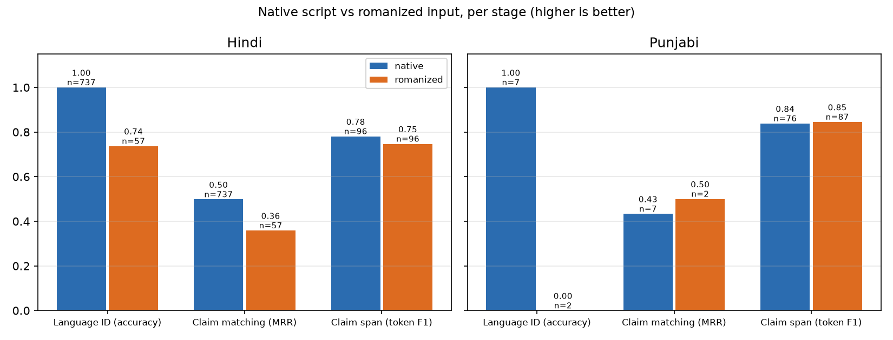

# TruthLens: multilingual claim verification for WhatsApp forwards in English, Hindi and Punjabi

CSE472 project report · Soumirya Sarangi · draft of 2026-10-02

> **Status of this draft.** Every section except §8 (test results) and the case
> tallies of §9 is complete and built from dev-split results. The test-split
> numbers come from the one pre-registered test run (`docs/test-protocol.md`) and
> are filled in after it. Every figure in this report carries the results file it
> came from — `(run <hash>)` refers to `results/<hash>.json` — and
> `scripts/check_report_numbers.py` verifies each one against that file.

## 1. Summary

TruthLens takes a forwarded WhatsApp message in English, Hindi or Punjabi —
in native script or typed in Latin letters — and answers with a verdict, the
sources behind it, a calibrated confidence, an explanation, and, when it is not
confident, an explicit refusal to judge. It mirrors how fact-checkers work:
first look for a published fact-check of the same claim (the *fast path*), and
only then retrieve evidence and reason over it (the *evidence path*).

**Read the verdict numbers against the right yardstick.** Published systems on
AVeriTeC report roughly 47–50% accuracy. On this data the majority class
(Refuted) is 61% of dev, so always answering "Refuted" scores accuracy 0.61 and
macro-F1 0.1516 (run 8350085fbc7f): accuracy alone would rank a constant above
every model. This report therefore leads with macro-F1 over five classes, always
beside the majority baseline. Because no AVeriTeC claim is `NotAClaim`, macro-F1
on AVeriTeC is capped at 0.80 by construction.

Headline findings, all on dev:

1. **Abstention is where the verdict becomes usable.** The served pipeline's
   macro-F1 is 0.2802 (run 164d2289c90b) against the majority's 0.1516. At the
   abstention threshold chosen on dev, it answers 60% of claims, and accuracy
   on those rises from 0.49 to 0.5867 (run 164d2289c90b). Calibration halves
   the gap between confidence and accuracy: ECE 0.0988 (run 204b09b37d27) →
   0.0690 (run 164d2289c90b).
2. **No stance model that reads evidence beat a control that reads only the
   claim.** A claim-only model under the learned aggregator scores 0.2949
   (run ab1cc94cd247). The best evidence-reading arm ties it. Much of what
   looks like verification on AVeriTeC is the claim's wording.
3. **Romanization costs most where retrieval meets meaning.** For Hindi, claim
   matching drops from MRR 0.4981 on native script to 0.3585 on romanized posts
   (run 3bebeaff50b0). Claim-span identification barely moves; for Punjabi it
   does not move at all.
4. **The fast path is precise only at high thresholds.** At the served τ = 0.90
   it fires rarely, and even then a fifth of its citations are wrong (Phase 4).
   That makes it a demo of the architecture, not a reliable shortcut yet.

## 2. Problem and users

Forwarded messages are the dominant channel for misinformation in India, and
they arrive in Hindi and Punjabi typed in whatever script the sender's keyboard
gives them, often Latin letters. The primary user is a person who has received
a forward and wants to know whether to believe it before passing it on. The
system's principles, in order of precedence (PRD §4):

- no verdict without evidence;
- abstaining is a feature, visibly different from "not enough evidence";
- every verdict shows its sources;
- romanized input is the primary case;
- honest numbers over good-looking ones.

**Non-goals, stated as decisions:** images, video and links; adjudicating
opinions, predictions or political values (these route to `NotAClaim`); a real
WhatsApp bot; redistributing any licensed dataset.

## 3. Data

| Use | Dataset | Splits (train / dev / test) | Notes |
| --- | --- | --- | --- |
| Verdict, evidence | AVeriTeC | 2,666 / 500 / 307 | Official test labels are withheld, so the local test split is 307 claims held out of the public train file, stratified by label (seed 42) |
| Claim spans | X-CLAIM (en/hi/pa) | 4,472 / 600 / 571 | Per-row script detection: Punjabi files hold Gurmukhi, Devanagari and Latin rows |
| Romanized spans | `x_claim_romanized` (built here) | — / 183 / 193 | X-CLAIM's native hi/pa eval posts, romanized (§7) |
| Claim matching | MultiClaim (en/hi/pa) | 25,137 / 3,153 / 3,156 | 78,077 fact-checks in the pool; naturally romanized Hindi posts; Punjabi has only 7 dev and 7 test posts |
| Normalization | CheckThat! 2025 Task 2 | — / dev / 1,485 test | Cross-dataset overlap with X-CLAIM resolved by removing train rows |
| Stance (derived) | AVeriTeC QA answers | 6,616 / 1,260 / 789 | Labels inherited from the claim's verdict, so noisy by construction |
| Real forwards | Hand-typed (collected) | — / 100 / — | 64 hi / 36 pa, all Latin script; 15 deliberate non-claims; 33 with a Gurmukhi rewrite |

**Integrity guarantees** were built before any model:
- splits are frozen under `SPLITS.lock` and rebuild byte for byte from the raw downloads in CI;
- four leakage checks (exact, near-duplicate, cross-dataset, semantic) run on every data change;
- the train split always yields to eval: overlapping train rows are dropped and eval rows never are;
- the test split is locked at every entry point that could look at it (§8).

## 4. System

```
forward ─► language layer ─► check-worthiness ─► claim extraction ─► (≤3 claims)
           LID, script,       heuristic gate      span model picks
           transliteration    (→ NotAClaim)       claim sentences
                                                        │
              ┌──────────── fast path: BGE-M3 over 78k fact-checks, cosine ≥ τ_match ──► verdict of the fact-check
              │
              └──────────── evidence path: BM25 top-200 → BGE-M3 passage rerank (RRF)
                            → stance per passage (NLI labels shown; XLM-R distribution
                            read by the verdict) → learned aggregator (LR, temperature)
                            → τ_abstain → IndicBART explanation behind an NLI gate,
                            template fallback; manipulation flags (never change the verdict)
```

Every stage has at least two registered implementations, including a dumb
baseline, and is chosen by configuration. The served API and the evaluation
batch runner call the same orchestrator. The served pipeline runs in 4.60 GiB
of a 6 GB laptop GPU, answers in 2.51 s at the 95th percentile, and starts in
61 s (`docs/environment.md`).

## 5. Experiments, by syllabus unit

Every number is from AVeriTeC, X-CLAIM, MultiClaim or CheckThat! dev, beside
the baseline it had to beat.

### 5.1 Units I–II: representations, and the language layer

**Embedding ladder, scored as retrieval** (MultiClaim dev, 3,153 posts against
78,077 fact-checks, MRR; random baseline 0.0002):

| Encoder | MRR | Run |
| --- | --- | --- |
| Word2Vec (trained in-domain) | 0.0915 | 7a5b458b7ed0 |
| MuRIL | 0.1127 | 1cf1125ab395 |
| TF-IDF | 0.2311 | 04472bc51f18 |
| LaBSE | 0.3216 | 527489a99261 |
| **BGE-M3** | **0.5244** | 3bebeaff50b0 |

TF-IDF beats Word2Vec and MuRIL. Without a lexical rung in the table, MuRIL's
number would have read as a result instead of a warning. LaBSE, a translation
model, is used only for the cross-lingual t-SNE figure
(`docs/figures/tsne_parallel_claims.png`). That figure shows **romanization
forming a cluster of its own**: two unrelated sentences, one romanized Hindi and
one romanized Punjabi, are closer to each other than one sentence is to itself
across scripts.

**Language ID and transliteration on the 100 hand-typed forwards:**
- **Language ID.** A script rule cannot tell romanized Hindi from English, and
  neither can fastText. The hybrid (script, then a romanized-text classifier)
  reaches 0.85 accuracy (run 5dcb60467eca), where both alternatives score 0.
- **Transliteration back to Gurmukhi.** Rule-based CER is 0.4281
  (run f141a4d92b33) against 0.8518 for leaving the text alone; 0.3810 with
  the language given (run 331c34fb9bdd). An accurate transliterator would help
  most, but IndicXlit could not be installed without replacing the CUDA build of
  PyTorch.

### 5.2 Unit V: the front of the pipeline

**Claim spans (X-CLAIM dev, token F1 over claim tokens):**

| Arm | Token F1 | Run |
| --- | --- | --- |
| Whole post is the claim (baseline) | 0.6851 | c108ee694a53 |
| Monolingual, en / hi / pa | 0.7106 / 0.7053 / 0.7175 | (three runs, project log) |
| Zero-shot (trained on English only) | 0.7370 | f6cfdfc688fe |
| **Joint multilingual** | **0.7463** | f599f727f473 |

Joint training beats every monolingual arm, replicating X-CLAIM's own finding,
and zero-shot ties joint on Punjabi, so Punjabi span-finding is almost entirely
cross-lingual transfer.

The served extractor was, until Phase 7, a sentence rule. It had never been
scored on this task: 0.7095 (run 6debf902eac4), barely above the whole-post
baseline. On a real forward it checked "Dosto dhyan se padho!!" ("friends,
read carefully") and refuted it at 0.83. The served stage now lets the rule
decide *whether* there is a claim and the joint span model decide *which*
sentences: 0.7374 (run e1b2227b28d9), with the AVeriTeC verdict unchanged
within its confidence interval.

**Check-worthiness (FR-6).** On a check-worthiness set derived from X-CLAIM, a
trained classifier scores 0.7222 (run 9007de0fde93). On the 100 real forwards it
scores 0.4536 (run 702ab276ae11), below the majority baseline. Zero-shot NLI is
the only arm above the baseline there, at 0.5938 (run 34bd7770cb7f), but it
rejects about one real claim in five. The two sets rank the arms in opposite
orders, so the derived set cannot choose an operating point. The served gate
is the rule: a false "nothing to check" fails the user completely, while a false
"check-worthy" costs a harmless NEI.

**Normalization.** Extractive normalization scores chrF 0.2835
(run c080a5079e93), at the longest-sentence baseline. Only about 4% of
reference normalizations appear verbatim in their post, so the task needs an
abstractive model (cut, §11).

### 5.3 Claim matching and the fast path

BGE-M3 reaches MRR 0.5244 (run 3bebeaff50b0) against BM25's 0.3826
(run de7ef9c9bba3). Ranking well is not the same as *scoring* well. The fast
path needs the score to say when a match can be trusted, and correct and wrong
top-1 matches overlap heavily in cosine. The τ table (run da5132cee8a0) is the
result:
- at τ 0.70 the gate answers 40% of posts at 62.7% precision;
- at the served τ 0.90 it fires on about 2% and is still wrong about one time
  in five.

Both trained rerankers lost to the raw cosine. The cross-encoder learned to
score fact-checks rather than pairs, a construction bug in its training data
that is diagnosed in the project log.

### 5.4 Unit III: evidence retrieval and stance

**Retrieval (AVeriTeC dev).** Hybrid retrieval (BM25 top-200, BGE-M3 passage
rerank, reciprocal rank fusion) lifts Success@10 to 0.214 (run d153f28ff603)
from BM25's 0.158 (run cb8f6f0f3b5c). Read it against two ceilings:
- BM25 finds only 58% of gold documents within its top 200;
- 22.8% of dev claims have no gold document with any text at all.

**Stance: every trained model has a claim-only twin.** The derived stance
labels copy the claim's verdict onto every evidence answer, so the claim alone
predicts them. XLM-R + LoRA beats its claim-only twin, 0.4582
(run 19f53468cdc2) against 0.4098 (run 1e77b96812d3), on answered pairs. The
BiLSTM is the Unit III baseline.

### 5.5 Units IV and VI: verdict, calibration, abstention, explanation

**The rule aggregator rewarded ignoring the evidence.** Its Conflicting rule
fires whenever support and refutation co-occur. That can never happen to a
model that gives every passage the same distribution, so the claim-only control
won under the rule: 0.2514 (run 8350085fbc7f).

**The learned aggregator** (multinomial logistic regression over the whole
top-10 stance distribution, trained on cross-fitted stance outputs,
temperature-scaled on dev) beats the rule on the control by
0.0435 (run ab1cc94cd247), 95% interval [+0.0073, +0.0779]. Against it:

| Stance arm | Verdict macro-F1 | Run |
| --- | --- | --- |
| claim-only control | 0.2949 | ab1cc94cd247 |
| XLM-R (reads evidence) | 0.2802 | 7750edef4c7a |
| BiLSTM | 0.2340 | 2089ec927435 |
| NLI, zero-shot | 0.2135 | c2ffd949681b |

XLM-R ties the control on a paired bootstrap, and the BiLSTM and NLI arms are
significantly worse. **The served stance does two jobs with two models.** XLM-R
decides the verdict: +0.0667 macro-F1 over NLI (run 24d42acb4fea), with a 95%
interval of [+0.022, +0.112]. NLI labels the passages the user sees, because XLM-R labels
nearly every passage "Refutes" whatever it says.

**Calibration and abstention.**
- Temperature scaling, fitted on dev, takes ECE from 0.0988
  (run 204b09b37d27) to 0.0690 (run 164d2289c90b).
- τ_abstain was fixed before measuring, by a rule written in advance: the lowest
  threshold leaving at most 60% of claims answered. That gives τ 0.3835 and
  accuracy 0.5867 on the answered 60% (run 164d2289c90b).
- The full coverage curve is `docs/figures/abstention_curve.png`, with the
  majority line drawn on it. The reliability diagram is `docs/figures/reliability.png`.

**Explanations.** IndicBART + LoRA writes an English explanation from the
retrieved passages. An NLI gate serves it only if every sentence is entailed by
a shown passage, and none restates the claim under a verdict other than
Supported; otherwise the template is served.
- **Faithfulness, by decoding.** Before the gate, beam search is faithful 0.524
  of the time (run 1db244b950ad). Greedy is 0.500 (run 9d827bf6c5ab) and
  nucleus sampling 0.408 (run 49db61975b8d).
- **Against the baseline.** Copying the top passage's first sentence scores
  0.628. It is faithful by construction, which is why chrF against reference
  justifications is reported beside it.
- **Gold evidence is worse here, for a measured reason.** On gold QA evidence
  faithfulness falls to 0.272 (run d0b2219a6411), because the model paraphrases
  shorter evidence into contradictions.
- **The attention figure** (`docs/figures/explainer_attention.png`) shows the
  decoder's cross-attention over the evidence passages.

## 6. Demo

The page (`app/`) is styled after the chat app the forward came from. It has a
verdict card with an icon and a word (never colour alone), a confidence band
rather than a percentage, an abstained card that shows the would-be verdict
greyed as "Leaning: …", and an evidence trail with stance tags and highlighted
spans; each `[n]` in the explanation jumps to its source. Six sample chips cover
the six paths of UI_UX §11. `scripts/demo_check.py` fails if any chip stops
showing its path. Contrast meets WCAG AA in light and dark mode
(`tests/test_ui_static.py`).

## 7. The research contribution: the romanization penalty



| Stage | Hindi native → romanized | Punjabi native → romanized | Run(s) |
| --- | --- | --- | --- |
| Language ID (accuracy) | 1.00 → 0.74 (n = 737 / 57) | 1.00 → 0.00 (n = 7 / 2) | 7f4d2e1ee058 |
| Claim matching (MRR) | 0.4981 → 0.3585 | 0.4333 → 0.5000 (n = 7 / 2) | 3bebeaff50b0 |
| Claim span (token F1, same posts) | 0.7805 → 0.7468 | 0.8382 → 0.8453 | 02c59ee296a0 / f05dd5f44b16 |

- **Matching pays the largest measured price.** Hindi loses 28% of its MRR
  when the post is romanized: semantic retrieval meets a script-shaped cluster
  (§5.1).
- **Span identification pays little.** It is a token-tagging task, and for
  Punjabi it pays nothing, consistent with Punjabi spans being cross-lingual
  transfer to begin with.
- **The span row is a lower bound.** Its romanized half is synthetic. The
  romanizer (Dakshina's lexicon, plus rules for words it lacks) is CER 0.2141
  (run 3f33f4e33934) away from how people actually typed the same Punjabi
  messages, against 0.8046 for doing nothing, so real romanized input will cost
  more.
- **Punjabi matching cells are single digits** and support no conclusion.

## 8. Test results

*(Filled in from the one pre-registered test run, `docs/test-protocol.md`. Every
test command was proven on dev to reproduce its dev twin's predictions byte for
byte before the run.)*

**Why the AVeriTeC verdict excludes the fast path.** AVeriTeC claims are taken
from fact-check articles, and the matcher's pool contains fact-checks. Run with
the matcher on, the fast path answered dev claims by finding the claim's *own*
source article, which AVeriTeC's rules exclude as evidence. It changed
macro-F1 only slightly, to 0.2819 (run 5d4fd8d511e6), but that is a lookup, not
verification. Every AVeriTeC verdict number, dev and test, is the evidence
path. The fast path is measured on MultiClaim.

## 9. Error analysis

*(Method and categories fixed before any case was read: `docs/error-analysis.md`.
Ten real failures per language, after the test run.)*

The question it starts from is the failure the demo showed: **true claims
refuted with high confidence.** Examples are Modi as Gujarat's chief minister,
the Taj Mahal, and the Harmandir Sahib in Amritsar, refuted at confidences up
to 0.72. On AVeriTeC dev this happens to only 3 of the 122 Supported claims at
confidence ≥ 0.60. The demo forwards hit it often because the demo corpus is
Wikipedia leads plus fact-check titles, and a fact-check title about a
*different* rumour about the same entity reads as refutation.

## 10. Ethics

- **Scope.** TruthLens judges *evidence*, never truth. It never says "true" or
  "false", and its copy avoids alarm language. Opinions, predictions and value
  judgements route to "nothing here to fact-check" rather than receiving a
  verdict.
- **Sources always shown.** No verdict appears without the passages or
  fact-check behind it, and every card says the system can be wrong.
- **Declining is designed in.** The abstained state is visually distinct, and
  the confidence bands are calibrated on held-out data rather than taken from
  raw model scores.
- **Known harm: confident wrong refutations of true claims** (§9). They are the
  failure most likely to erode trust in a true message, and they are stated
  here rather than hidden.
- **Language equity.** Punjabi is under-resourced in every dataset used (7
  Punjabi posts in MultiClaim dev, 346 X-CLAIM training examples). Any Punjabi
  figure carries its n. Explanations are English for every input (§11).
- **Data and privacy.**
  - The repository commits identifiers and hashes, never dataset text.
  - AVeriTeC is CC BY-NC 4.0; MultiClaim is access-restricted.
  - The hand-typed forwards are volunteers' own writing and stay local.
  - The system runs offline; input text is not logged.
- **Unverified translations.** The Hindi and Punjabi interface strings are
  marked unverified until a native speaker reviews them
  (`docs/i18n-review.md`). No demo runs before that review.

## 11. Limitations and cuts

Each cut is recorded with its reason, as SRS §7 requires.

| Cut | Reason |
| --- | --- |
| Explanation in the input language (FR-17, P1) | Cut-list item 3. The explainer is trained on English AVeriTeC justifications. Hindi and Punjabi users get an English explanation and the card says so. |
| Live search (P2) | Cut-list item 2. A static corpus means recent claims are out of reach. |
| Manipulation detection as a trained classifier | Cut-list item 1. Built instead as rules plus zero-shot NLI over SemEval-2023 Task 3 technique names. It is unmeasured because the SemEval data was never obtained. |
| Prompted-LLM explanation comparison | Slack-only by plan. Phase 6 had no slack. |
| IndicXlit transliterator | Installing it replaces the CUDA build of PyTorch with the CPU one. |
| Abstractive normalization | Measured as necessary (§5.2) but not built in 14 days. |
| Within-query reranker objective | Diagnosed (§5.3), not rebuilt. |
| k ablation for the aggregator | Evidence does not move the verdict beyond the claim prior, so the passage count cannot matter much. |

**Further limitations:**
- Check-worthiness has no unbiased test number. The only real set chose the arm.
- 22.8% of AVeriTeC dev claims have no retrievable gold evidence.
- Every derived stance label is noisy by construction.
- The served pipeline uses 4.60 of the roughly 4.9 GiB that Windows leaves usable on the GPU.

## 12. Reproducibility

- `make setup && make test` reproduces the environment and the test suite.
- `make eval CONFIG=configs/<name>.yaml` reproduces any number. Every results
  file records its config hash, its predictions and split checksums, the git
  SHA and the environment, with seed 42 throughout.
- `docs/results.md` is generated from `results/`.
- The project log (`docs/project-log.md`) records every decision and every
  number that was later corrected.
- The acceptance matrix (`docs/acceptance.md`) maps each requirement to the test,
  run or demo step that verifies it.
