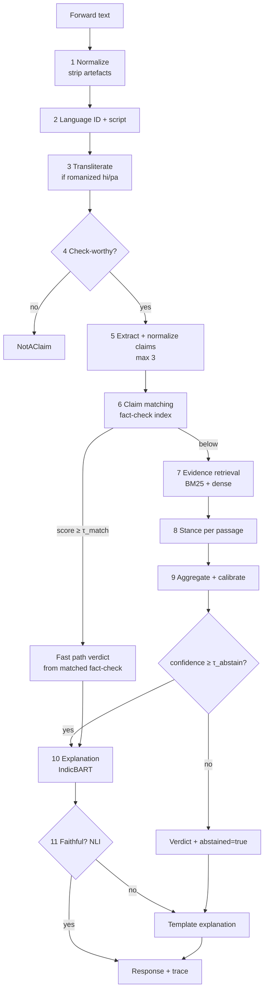

# TruthLens — System Design

| | |
| --- | --- |
| **Status** | v1.0 · 21 Sep 2026 |
| **Owns** | Architecture, stage contracts, API schema, resource budget, failure handling |
| **Does not own** | Requirements → `SRS.md` · screens → `UI_UX.md` · metric definitions → `CLAUDE.md` and `src/eval/` |
| **Rule** | This document describes contracts. If existing code already defines something here, **the code wins** and this document gets corrected |

---

## 1. The one design idea

**The served pipeline and the evaluated pipeline are the same code.**

Every stage is a function from a typed input to a typed output. The API runs stages one forward at a time. A batch runner runs the same stages over a frozen split and writes a predictions JSONL, which the existing harness scores. There is no separate "research code" and "demo code" to drift apart — which is the most common way a project like this ends up demoing a system that isn't the one that was evaluated.

## 2. Architecture



Two tracks, as in the build plan: the fast path (6) mirrors how fact-checkers work; the evidence path (7–9) is the fallback. An abstained verdict still gets an explanation, but always the template one — no generated prose for something the system has said it isn't sure about.

## 3. Stage contract

Every stage implements one interface:

```python
class Stage(Protocol):
    name: str                      # "retrieval", "stance", ...
    impl: str                      # "bm25", "bge_m3", "baseline_majority", ...

    def run(self, trace: Trace) -> Trace: ...
```

Rules:

- A stage **reads** only the fields earlier stages wrote and **writes** only its own field. It never mutates another stage's output.
- A stage records its latency, and any degradation, in `trace.events`.
- Every stage has at least two implementations **by the phase that introduces its model** -- a baseline and the model. Which one runs is chosen by pipeline config, never by editing code. In earlier phases a stage legitimately has only its stub: Phase 1 ships two implementations for `retrieval` (bm25, random) and `stance` (nli, always_neutral), and one each for the stages whose models arrive in Phases 3-6.
- Stages import models lazily, so the harness and CI keep running on the core lock with no torch installed.

## 4. Data contract

Pydantic models in `src/pipeline/contracts.py`. The label strings are **imported** from `src/data/labels.py`, never retyped — that module is already the single label registry.

Two vocabulary rules, because the pipeline and the frozen splits share most of their terms but not all of them:

- **`Script` has exactly the three values `src/data/script_id.py` returns.** No `"mixed"` value. `detect_script()` picks the dominant script; `script_purity()` reports how dominant it was, and that continuous figure is carried as `Preprocessed.script_purity`. A fourth enum value would create a new per-script cell in the harness breakdown and change the native-vs-romanized table the research contribution rests on, for a distinction a float already expresses better.
- **`Lang` adds `"other"`, which is runtime only.** `src/data/splits.py` allows `en`/`hi`/`pa` and `validate_split_record` rejects anything else. No split row is ever `"other"` — it exists so an unsupported-language *request* has somewhere to go. Do not "fix" the split schema to match.

```python
Lang   = Literal["en", "hi", "pa", "other"]                    # "other" is RUNTIME ONLY
Script = Literal["deva", "guru", "latn"]                       # what detect_script returns
Stance = Literal["Supports", "Refutes", "Neutral"]             # STANCE_3CLASS
Verdict = Literal["Supported", "Refuted", "Conflicting",
                  "NEI", "NotAClaim"]                          # VERDICT_5CLASS

class Preprocessed(BaseModel):
    original: str
    normalized: str
    lang: Lang
    script: Script
    script_purity: float            # 1.0 = single script, ~0.5 = heavily code-mixed
    transliterated: str | None      # set only if romanized hi/pa

class Claim(BaseModel):
    claim_id: str                   # "c1", "c2", "c3"
    text: str                       # normalized, standalone
    span: tuple[int, int] | None    # offsets into Preprocessed.normalized

class FactCheckMatch(BaseModel):
    factcheck_id: str
    score: float
    verdict: Verdict                # mapped from the publisher's rating
    title: str
    url: str
    publisher: str
    lang: Lang

class Passage(BaseModel):
    passage_id: str                 # stable, citable: "e1", "e2"...
    doc_id: str
    text: str
    url: str | None
    title: str | None
    retrieval_score: float
    stance: Stance | None = None
    stance_prob: float | None = None
    highlight: tuple[int, int] | None = None

class ClaimResult(BaseModel):
    claim: Claim
    path: Literal["fast", "evidence", "none"]
    match: FactCheckMatch | None
    passages: list[Passage]
    verdict: Verdict
    confidence: float               # calibrated, 0..1
    abstained: bool
    explanation: str
    explanation_source: Literal["generated", "template"]
    explanation_lang: Lang
    cited: list[str]                # passage_ids or factcheck_id
    faithfulness: float | None      # NLI entailment prob, if generated
    manipulation_flags: list[str] = []

class Event(BaseModel):
    stage: str
    impl: str
    ms: float
    note: str | None = None         # e.g. "degraded: dense->bm25"

class Trace(BaseModel):
    request_id: str
    pre: Preprocessed | None = None
    checkworthy: bool | None = None
    claims: list[Claim] = []
    results: list[ClaimResult] = []
    unchecked_claims: list[str] = []   # beyond the max-3 cap
    events: list[Event] = []
```

## 5. Module map

Existing directories in `src/` keep their meaning. Only `src/pipeline/` and `app/` contents are new.

| Path | Contents | Phase |
| --- | --- | --- |
| `src/pipeline/contracts.py` | Models in §4 | 1 |
| `src/pipeline/orchestrator.py` | Runs stages in order, applies τ values, handles degradation | 1 |
| `src/pipeline/registry.py` | Maps `(stage, impl)` to a class | 1 |
| `src/pipeline/batch.py` | Runs a stage over a frozen split → predictions JSONL | 1 |
| `src/preprocess/` | Normalize, language ID, transliteration. Reuses `src/data/script_id.py` | 1 stub, 2 real |
| `src/claims/` | Check-worthiness, span extraction, normalization | 1 passthrough, 3 real |
| `src/matching/` | Fact-check index and matcher | 4 |
| `src/retrieval/` | BM25, BGE-M3, hybrid. Conventions already in `src/retrieval/CLAUDE.md` | 1 BM25, 5 hybrid |
| `src/stance/` | NLI-as-stance baseline, BiLSTM, XLM-R-base | 1 NLI, 5 trained |
| `src/generation/` | Template, IndicBART | 1 template, 6 IndicBART |
| `src/faithfulness/` | NLI check, calibration, abstention | 1 stub, 6 real |
| `src/eval/` | **Unchanged.** Still the only place metrics exist | — |
| `app/main.py` | FastAPI app | 1 |
| `app/static/` | `index.html`, `app.js`, `styles.css`, `i18n/` | 1 plain, 7 styled |
| `configs/pipeline/*.yaml` | Which impl per stage, τ values, k values | 1 |

## 6. Orchestration logic

```python
def verify(text: str, cfg: PipelineConfig) -> Trace:
    t = Trace(request_id=new_id())
    t = normalize.run(t); t = lang_id.run(t); t = transliterate.run(t)
    if t.pre.lang == "other":
        return unsupported(t)
    t = checkworthy.run(t)
    if not t.checkworthy:
        return not_a_claim(t)                           # FR-6
    t = extract.run(t)                                  # max 3, FR-7
    for claim in t.claims:
        m = matcher.top1(claim)                         # FR-8
        if m and m.score >= cfg.tau_match:
            res = from_factcheck(claim, m)              # path="fast"
        else:
            ps = retriever.topk(claim, cfg.k)           # FR-9
            if not ps:
                res = nei_abstain(claim)                # FR-12
            else:
                ps = stance.label(claim, ps)            # FR-10
                v, conf = aggregate(ps)                 # FR-11, calibrated FR-13
                res = evidence_result(claim, ps, v, conf,
                                      abstained=conf < cfg.tau_abstain)  # FR-14
        res = explain(res)                              # FR-15, FR-16, FR-18
        t.results.append(res)
    return t
```

**Baseline aggregator, Phase 1** — deliberately simple and fully specified, so it's a real floor:

| Condition over the top-k passages | Verdict |
| --- | --- |
| max P(Supports) ≥ 0.5 and max P(Refutes) ≥ 0.5 | Conflicting |
| max P(Supports) ≥ 0.5 | Supported |
| max P(Refutes) ≥ 0.5 | Refuted |
| otherwise | NEI |

Confidence = the winning probability. Phase 6 replaces this with a learned aggregator plus temperature scaling; the Phase 1 version stays registered as `aggregate_rule` so the improvement is measurable.

`τ_match` and `τ_abstain` live in `configs/pipeline/*.yaml`, are chosen on dev, and are reported by `GET /version`.

## 7. Corpora and indexes

This is the part most likely to be underestimated, so it is spelled out.

| Mode | Evidence source | Why |
| --- | --- | --- |
| **Evaluation** | AVeriTeC knowledge store, **per claim** | AVeriTeC ships a candidate pool per claim, not one global corpus. Retrieval evaluation ranks within that pool — the standard, comparable protocol |
| **Demo** | One global index over a bounded corpus | A new forward has no per-claim pool, so the demo needs a real global index |

**The demo corpus has to be bounded.** Full English Wikipedia is millions of articles; dense-indexing it on a laptop is not a 14-day task. Proposed demo corpus:

1. The union of all AVeriTeC knowledge-store documents already downloaded — real web articles about real misinformation claims, which is exactly the right domain.
2. Hindi and Punjabi Wikipedia, which are small enough to index in full.
3. MultiClaim fact-check texts once available — the fast path's own index doubles as evidence.

Stated limitation for the report: without live search (cut list item 2), claims about events after the corpus snapshot get NEI. **The fast path is what makes the demo work on genuinely new, realistic forwards**, which is another reason it is never cut.

Index layout, all under `data/index/` (gitignored, rebuilt by a make target):

| Index | Contents | Size estimate |
| --- | --- | --- |
| `factcheck.faiss` | BGE-M3 dense, 1024-d, fp16, flat inner product | ~200k fact-checks ≈ 0.4 GB |
| `factcheck.bm25.pkl` | BM25 over fact-check titles and claims | small |
| `evidence.faiss` | BGE-M3 over ~512-token passages of the demo corpus | measure after chunking; budget ≤ 3 GB on disk |
| `evidence.bm25.pkl` | BM25 over the same passages | — |

## 8. API

### `POST /verify`

Request:

```json
{ "text": "ye sach hai kya ki ...", "lang_hint": null, "include_trace": true }
```

Response (`200`):

```json
{
  "request_id": "a1b2c3",
  "input": { "original": "...", "lang": "hi", "script": "latn",
             "transliterated": "ये सच है क्या कि ..." },
  "checkworthy": true,
  "results": [
    {
      "claim": { "claim_id": "c1", "text": "..." },
      "path": "evidence",
      "verdict": "Refuted",
      "confidence": 0.78,
      "abstained": false,
      "explanation": "... [e1] ... [e3]",
      "explanation_source": "generated",
      "explanation_lang": "hi",
      "cited": ["e1", "e3"],
      "passages": [ { "passage_id": "e1", "title": "...", "url": "...",
                      "text": "...", "stance": "Refutes",
                      "stance_prob": 0.91, "highlight": [120, 184] } ],
      "match": null,
      "manipulation_flags": []
    }
  ],
  "unchecked_claims": [],
  "trace": { "events": [ { "stage": "retrieval", "impl": "hybrid", "ms": 412.0 } ] }
}
```

Errors:

| Code | When |
| --- | --- |
| `422` | Empty, too long, or not UTF-8 (FR-1) |
| `200` with `checkworthy: false` | No claim — this is an answer, not an error |
| `200` with `input.lang: "other"` and empty `results` | Unsupported language — also an answer |
| `503` | A required model isn't loaded; `/health` says which |
| `504` | Whole request over 30 s |

### `GET /health`

`{ "status": "ok" | "degraded", "stages": { "retrieval": "bge_m3:loaded", "generation": "indicbart:not_loaded", ... } }`

### `GET /version`

```json
{
  "git_sha": "...",
  "pipeline_config": "configs/pipeline/demo.yaml",
  "config_hash": "...",
  "tau_match": 0.0,
  "tau_abstain": 0.0,
  "confidence_bands": { "high": 0.0, "medium": 0.0 }
}
```

`confidence_bands` carries the High/Medium cut points from `UI_UX.md` §7. They are chosen from the calibration curve on dev and served here because that document forbids hard-coding them in JavaScript — so the API has to be where they come from.

## 9. Integration with the existing harness

Nothing in `src/eval/` changes. Each stage gets a batch entry point:

```bash
python -m pipeline.batch --stage retrieval --impl bm25 \
    --split data/splits/averitec/dev.jsonl --out results/preds/p1_bm25.jsonl
make eval CONFIG=configs/p1_bm25_retrieval.yaml
```

Split files hold IDs, not text (Phase 0 decision). `pipeline/batch.py` resolves text from `data/interim/` the same way the loaders do.

| Stage | Harness task | Gold comes from |
| --- | --- | --- |
| Check-worthiness | classification, `checkworthy_binary` | X-CLAIM, CheckThat! |
| Claim span | span — **harness support to be added in Phase 3** | X-CLAIM |
| Claim matching | retrieval | MultiClaim pairs |
| Evidence retrieval | retrieval | AVeriTeC gold evidence URLs within the knowledge store |
| Stance | classification, `stance_3class` | Derived from AVeriTeC QA annotations, or FEVER warm-start |
| Verdict | classification, `verdict_5class` | AVeriTeC labels |
| Faithfulness | faithfulness — registered, currently `NotImplementedError` | Phase 6 |

The harness has no span task yet. Adding one in Phase 3 is a harness change and follows harness rules: pure metric functions, checked against hand-computed values, tests before use.

## 10. Models and GPU budget

| Stage | Model | Params | fp16 weights | Where it runs |
| --- | --- | --- | --- | --- |
| Language ID | fastText `lid.176` | — | ~130 MB, RAM | CPU |
| Transliteration | IndicXlit | ~11M | tiny | CPU |
| Retrieval, matching | BGE-M3 | 568M | ~1.1 GB | GPU |
| Stance, check-worthiness, span | XLM-R-base (+LoRA heads) | 278M | ~0.6 GB | GPU |
| NLI (Phase 1 stance + faithfulness) | multilingual mDeBERTa-v3-base NLI | ~279M | ~0.6 GB | GPU |
| Generation | IndicBART | 244M | ~0.5 GB | GPU |
| t-SNE figure only | LaBSE | 471M | — | offline script, never served |

Resident at inference: **~2.8 GB of weights**, leaving room for activations inside the 5.5 GB ceiling (NFR-3). Measure it with `torch.cuda.max_memory_allocated()` and write the figure into `docs/environment.md`, rather than trusting this estimate.

Training: one model at a time, API server stopped, LoRA via `peft`, fp16, gradient checkpointing, batch size found by halving until it fits. Queue long runs overnight.

**Two environment facts the current docs get wrong:**

- `docs/environment.md` says to install torch from the **CPU** index. This machine has an RTX 4050, so install the **CUDA** build and record the build string. Training on CPU would silently burn every day of the timeline.
- IndicXlit's package has historically depended on fairseq, which is hard to install on Windows and Python 3.11. **Day 2 starts with a 30-minute install spike.** If it fails, the fallback is IndicXlit through WSL, or a rule-based transliterator (`indic-transliteration`) with its lower accuracy on informal spelling measured and reported, not hidden.

## 11. Failure handling

| Failure | Behaviour | Recorded as |
| --- | --- | --- |
| Dense retriever unavailable | BM25 only | `event.note = "degraded: dense->bm25"` |
| Matcher or index unavailable | Evidence path only | `degraded: no fast path` |
| Generation error or over 8 s | Template explanation | `explanation_source = "template"` |
| Explanation fails NLI check | Template explanation | `faithfulness` kept, source = template |
| Verdict abstained (`confidence < τ_abstain`) | Template explanation, never generated prose | `explanation_source = "template"` |
| Zero passages retrieved | `NEI`, `abstained = true` | FR-12 |
| Transliteration fails | Continue on original text, script stays `latn` | `degraded: no transliteration` |

The rule: degrade, record it, never crash, never make up a verdict.

## 12. Testing

| Layer | What | Where |
| --- | --- | --- |
| Contracts | Round-trip every model in §4; labels match `labels.py` | `tests/test_contracts.py` |
| Stages | Each impl on a handful of fixed inputs; baseline impls fully deterministic | `tests/test_stage_*.py` |
| Orchestrator | Golden traces: one per path — NotAClaim, fast, evidence, abstain, degraded | `tests/test_orchestrator.py` |
| API | FastAPI `TestClient`, schema, error codes | `tests/test_api.py` |
| Batch ↔ harness | A stage's batch output passes `make eval` on a toy split | `tests/test_batch.py` |
| Existing | Leakage, frozen splits, metrics — untouched | as is |

Tests that need model weights are marked `@pytest.mark.gpu` and skipped in CI, which runs on the core lock only.

## 13. Running it

```bash
make setup-ml                       # exists. Plus the CUDA torch build, see §10
make kb && make kb-cache            # exists. Evidence store + its per-claim cache
make serve                          # exists. uvicorn app.main:app
make index                          # PHASE 4/5, not Phase 1 -- see below
```

Single process, models loaded once at startup, one warm-up request so the first real request isn't a cold one.

**There is no `make index` in Phase 1, by design.** AVeriTeC ranks within a
claim's own candidate pool (§7), so retrieval builds a BM25 index over ~1000
documents, scores it and discards it -- measured at ~0.1 s per claim from the
cache. A persistent index would answer a different question than the benchmark
asks. `make index` becomes real when there is something global to index: the
fact-check index in Phase 4 and the demo evidence corpus in Phase 5.

What Phase 1 does need once is `make kb-cache`, which flattens the 11.5 GB
archive into per-claim JSONL. That is a cache, not an index.

## 14. Open design decisions

| Decision | Default until decided | Decide by |
| --- | --- | --- |
| Demo corpus composition | §7 proposal | Day 5 |
| Stance gold source | AVeriTeC QA-derived, FEVER warm-start if too thin | Day 7 |
| Learned aggregator form | Logistic regression over stance features | Day 9 |
| Manipulation flags | Zero-shot plus rules, or dropped | Day 11 |
